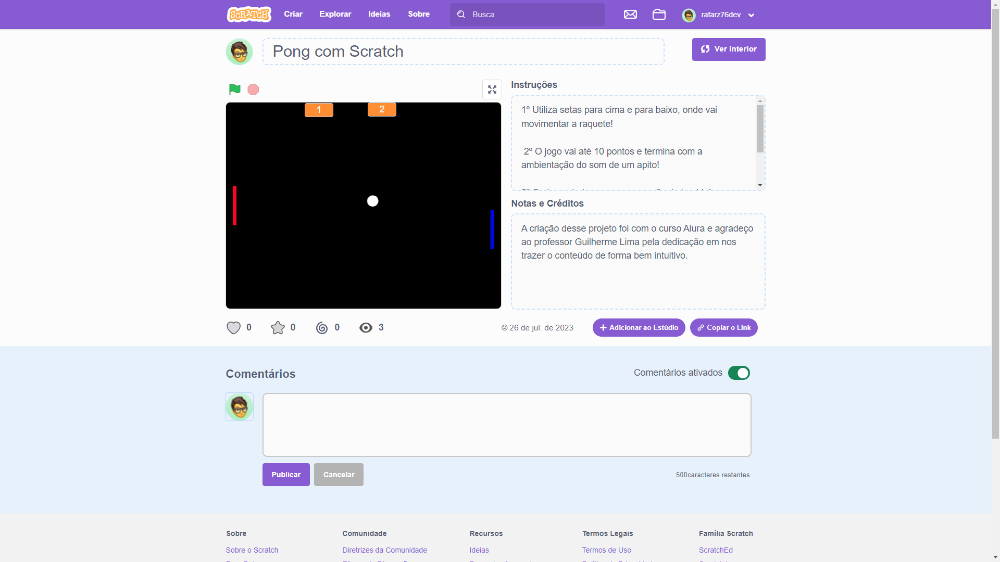

***
<div align="center">

[](https://git.io/typing-svg)


<a href="https://git.io/typing-svg" align="center"></a>  

***
##   Venho aqui apresentar   
  
# **_Jogo do Pong_**

<div align="left">
  
- O projeto ```jogo do Pong``` foi desenvolvido com o [curso da Alura](https://cursos.alura.com.br/dashboard) buscando sempre ampliar meus conhecimentos e com a principal linguagem de programação => ```Scratch```.  
- Implementou-se a colisão da bolinha com as bordas, ```minha raquete``` e ```raquete do oponente```.
- Movimentos da Raquete de forma ```individual```, para acertar a ```bolinha``` na maioria das vezes.
- Criou-se o ```placar do jogo```, indicando os ```meus pontos``` e do ```oponente``` e quando chegar a ```10 termina com ambientação do som de um apito```, indicando o ```vencedor```.
- Adicionados ```sons``` e também editada a página do jogo no ```Scratch```, para  ```usuários``` interagirem e assim jogar, neste projeto incrível e de alta performance.
  
###  
## [Clique aqui para acessar o Pong](https://scratch.mit.edu/projects/877702952)

<br>

 [Demonstração do Pong]   



<div align="left">

<br>

***

##   Tecnologias utilizadas no projeto

- [Scratch](https://scratch.mit.edu/)

<br>

***

##   Agora que você está pronto, venha interagir com o projeto 😉🚀

<br>

   - ##  Autor

<p>
    
    <p>&nbsp&nbsp&nbspRafaRz76Dev<br>
    &nbsp&nbsp&nbsp<a href="https://api.whatsapp.com/send/?phone=47999327137">Whatsapp</a>&nbsp;|&nbsp;<a href="https://www.linkedin.com/in/rafael-raizer//">LinkedIn</a>&nbsp;|&nbsp;<a href="https://github.com/RafaRz76Dev">GitHub</a>|&nbsp;<a href="https://public.tableau.com/app/profile/rafael.raizer">Tableau</a>|&nbsp;<a href="https://portifolio-rafarz76dev.netlify.app/">Portfólio</a>&nbsp;</p>
</p>
